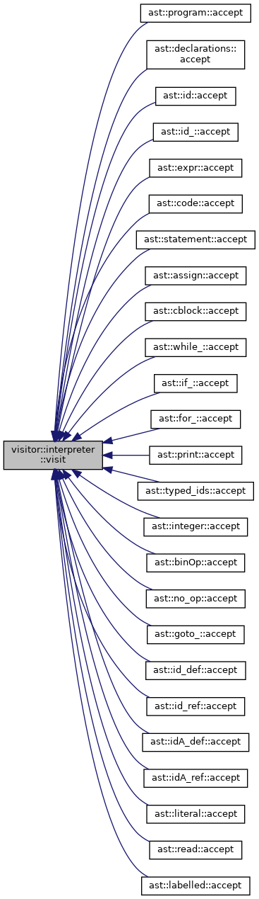

Compilers Course Project
===

# Report

* Jerin Philip [`<jerin.philip@research.iiit.ac.in>`](mailto:jerin.philip@research.iiit.ac.in)
* 201401071

# FlatB

## Description

## Semantics

The following example illustrates a FlatB program.

```cpp

declblock {
    int x, y; // Integer 
    int A[100];  // Integer Array 
}

codeblock {

    // Assignment 
    x = 0;
    y = 2;
    A[x] = 1;
    A[y] = 2;

    // Arithmetic Expressions

    x = y + 2;
    y = x * 3 + y;

    // IO 
    print "Value of x is:", x;
    read y;
    read A[y];

    
    // Conditionals 
    if ( x < y ) {
        print " x < y : ", x, "<", y;
    } else {
        
        print " x > y : ", x, ">", y;
    }


    // Loops 
    for i=0, 100-1 {
        A[i] = i + 1;
    }

    for i=0, 100, 2 {
        print i;
        
    }

    x = 100; 
    while ( x > 0 ){
        print x;
        x = x - 1;
    }

L1: x = 100;
    x = x - 1;
    goto L1 if (x > 0); // Conditional goto 


L2: x = 100;
    if (x / 2 < 25) {
        goto EXIT;  
    }
    x =  x - 3;
    goto L2; // Unconditional goto
    

EXIT: 
    print "Program exits now!";
    print "Goodbye world";
}

```


# AST 

The following UML Inheritance diagram describes AST: 


It should be understandable which class maps to which statement/construct of the programming language.


# Visitor pattern

The visitor patter enables separation of the algorithm - here the interpretation or compilation by run-time detection of which member of the class hierarchy an object resolves to.

The following diagrams shows how compiler's and interpreter's `visit` functions are called with the types of the respective ast node object by using `accept` inside the ast node object.




{width=50%}
{width=50%}

From the call-graph, we can deduce that the calls for the base node is being processed, and internally, using v-table rerouted to the respective object's accept. There is no explicit cast to the actual object in the program.

## Interpreter

The interpreter is written in C++. The AST Structure and the corresponding logic is programmed as a visitor, shown in the earlier diagrams.


## Compiler

Compiler emits LLVM 5 IR equivalent to the logic of the program, loading it from the AST.


# Performance Comparison


